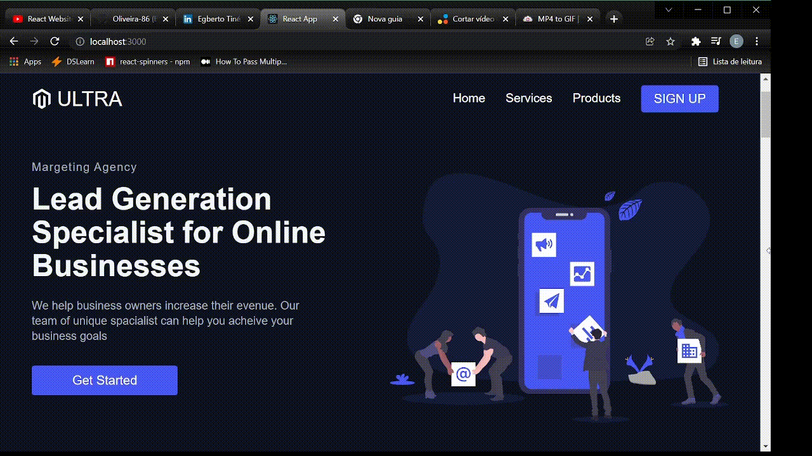

# ULTRA APP

#### I created this project to improve my skills in [Styled Components](https://styled-components.com/) a powerful tool to create CSS in Javascript files. This app is a responsive landing page with a nice design.

## The App

### Web

   
 
 
 
 ### Mobile

   
 
 
 
 ### Resposivity

   
 
 
 
 ### Technologies

##### - React
##### - Styled-Components

#### Install dependencies
    
    $ yarn install

#### Run the project

    $ yarn start
